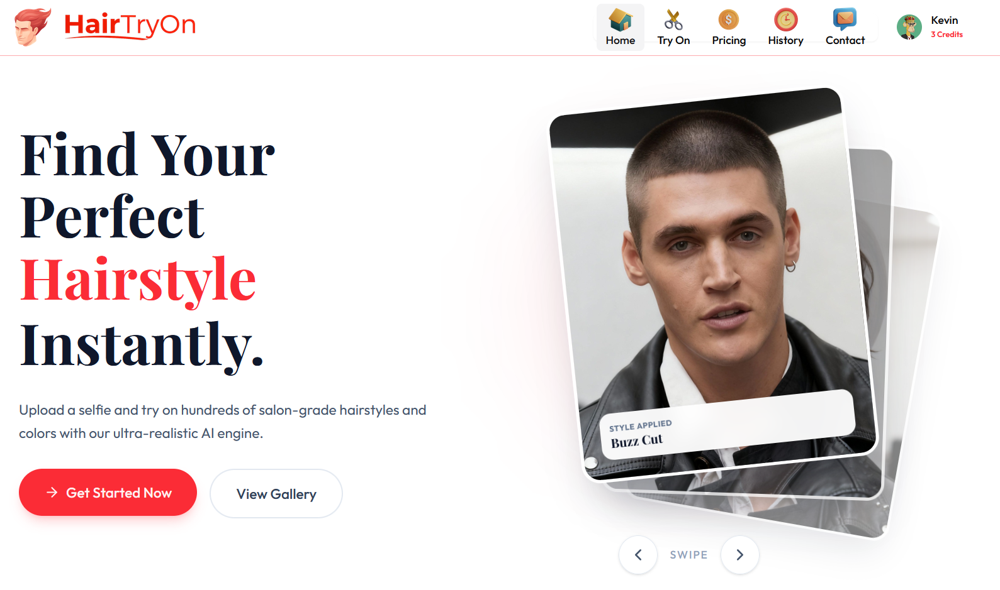
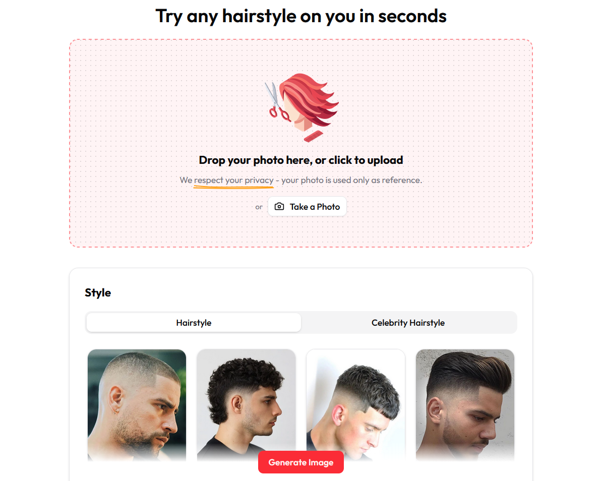
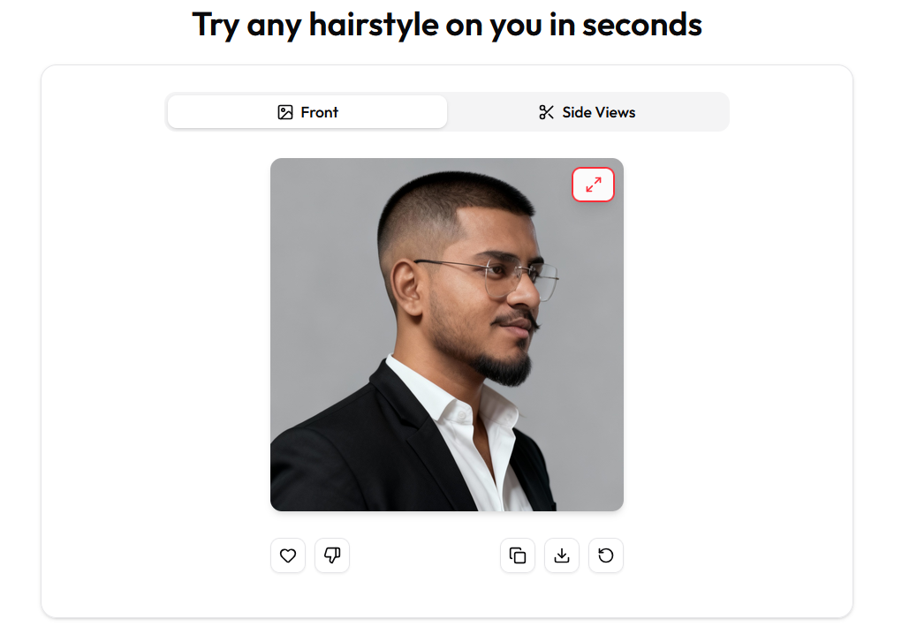
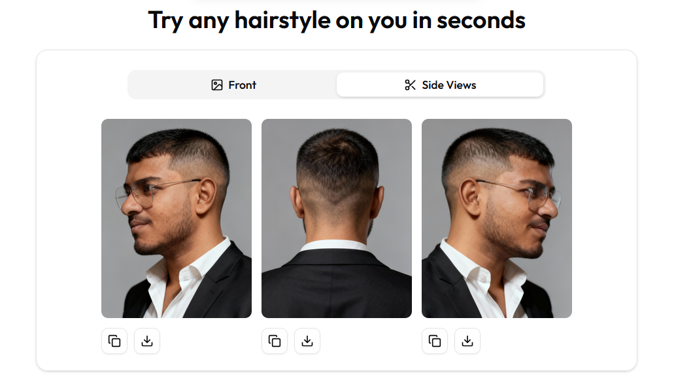

# Hair Try-On

A full-featured SaaS platform for virtual hair try-on with authentication, payment processing, rate limiting, monitoring, admin dashboard, and more.

## Screenshots

<table>
  <tr>
    <td width="50%">
      
      
<em>Landing page with main features and call-to-action</em>

    </td>
    <td width="50%">
      
      
<em>Interactive editor for trying on hairstyles</em>

    </td>
  </tr>
  <tr>
    <td width="50%">
      
      
<em>Front View</em>

    </td>   
    <td width="50%">
      
      
<em>Side View</em>

    </td>
  </tr>
</table>

## Overview

This application allows users to virtually try on different hairstyles using AI-powered image processing. Built with FastAPI for the backend and React for the frontend, it provides a seamless experience for users to visualize different hair options.

## Key Features

- 🔐 **Authentication** - Secure user authentication and authorization
- 💳 **Payment Integration** - Integrated payment processing for premium features
- ⚡ **Rate Limiting** - API rate limiting to ensure fair usage
- 📊 **Monitoring** - Real-time monitoring and analytics
- 👨‍💼 **Admin Dashboard** - Comprehensive admin panel for management
- 🎨 **AI-Powered Try-On** - Advanced hair try-on using AI technology
- 📱 **Responsive Design** - Works seamlessly across all devices

## Getting Started

### Frontend
See the `frontend` folder for frontend setup and deployment instructions.

### Backend
See the `backend` folder for backend setup and deployment instructions.

## Contact

For questions, support, or feedback, please reach out to [jesikamaraj@gmail.com](mailto:jesikamaraj@gmail.com).
